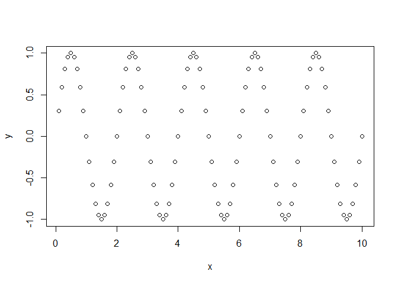

<!-- README.md is generated from README.Rmd. Please edit that file -->

# testPack

<!-- badges: start -->

<!-- badges: end -->

The goal of testPack is to test how to create a R package

## Installation

You can install the released version of testPack from
[CRAN](https://CRAN.R-project.org) with:

``` r
install.packages("testPack")
```

## Example

This is a basic example which shows you how to solve a common problem:

``` r
library(testPack)
## basic example code
```

What is special about using `README.Rmd` instead of just `README.md`?
You can include R chunks like so:

``` r
hello('dai')
#> [1] "Hello,dai world!"
```

# `{r cars} # summary(cars) #`

You’ll still need to render `README.Rmd` regularly, to keep `README.md`
up-to-date. `devtools::build_readme()` is handy for this. You could also
use GitHub Actions to re-render `README.Rmd` every time you push. An
example workflow can be found here:
<https://github.com/r-lib/actions/tree/master/examples>.

You can also embed plots, for example:

``` r
x = 1:100/10
y=sin(x*pi)
plot(x,y)
```




In that case, don’t forget to commit and push the resulting figure
files, so they display on GitHub and CRAN.
